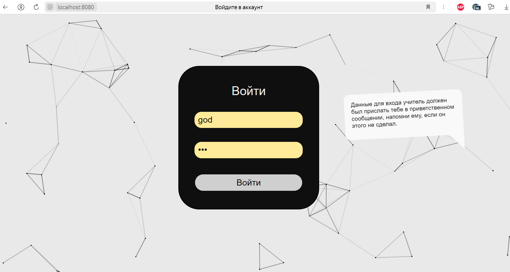
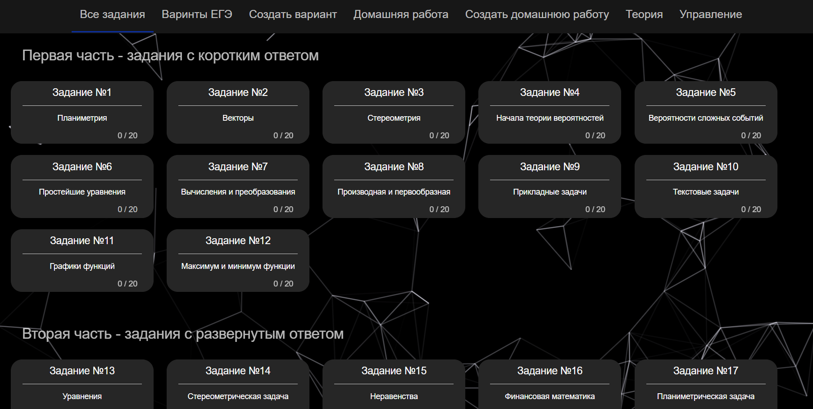
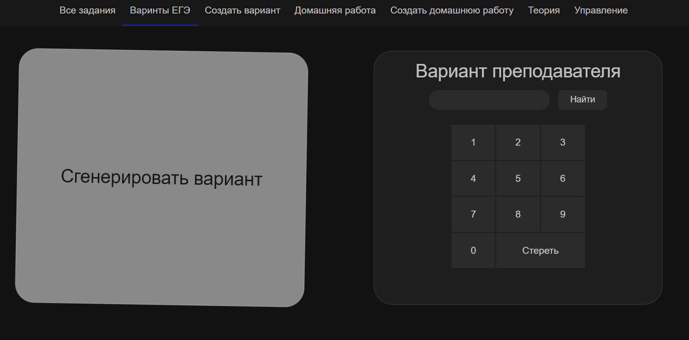
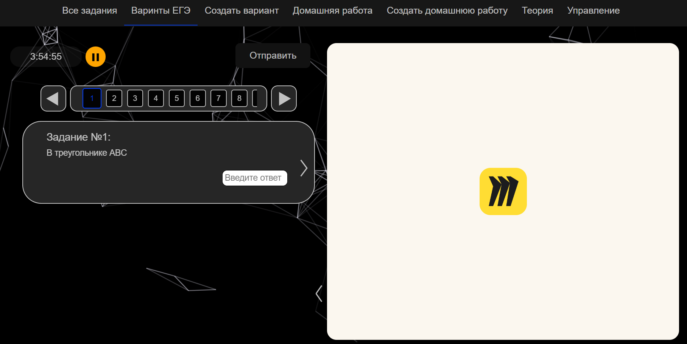
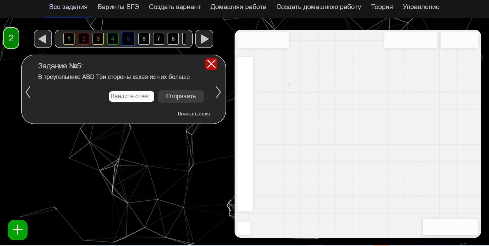

# MatrixSystem

MatrixSystem is a platform for online schools that helps tutors manage homework and tasks for their students and allows students solve tasks, homework and options of exam created by tutors.

## Screenshots

###User interface example 1

###User interface example 2

###User interface example 3

###User interface example 4

###User interface example 5



## Deployment

To deploy and start this project:


1. Pull docker image using:

```docker
docker pull bashkir7777/matrix-system
```
2. Run container using:

```docker
  docker run -p 8080:8080 -v matrix-db:/system/db -v matrix-db-images:/system/db/images --name matrix-app bashkir7777/matrix-system
```

3. Wait until the container successfully starts and open the link in a browser:
```url
http://localhost:8080/app/all-tasks
```
4. Login using precreated user:
```login
login: god
password: god
```


## Appendix

Note that the Miro board embedded here is for demonstration purposes only. To use it as intended, the administrator must have a premium Miro account
